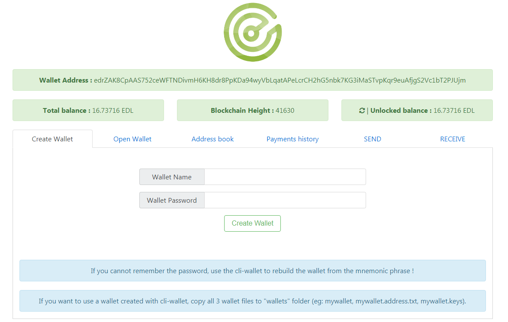
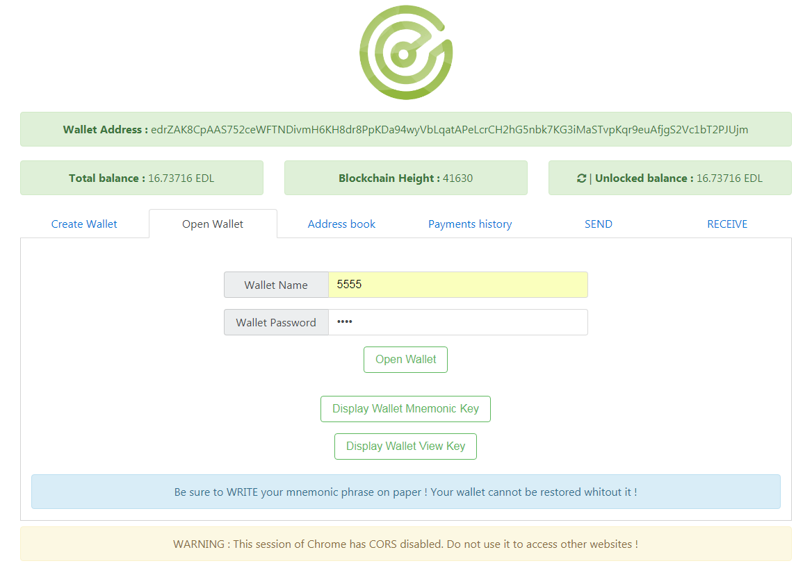
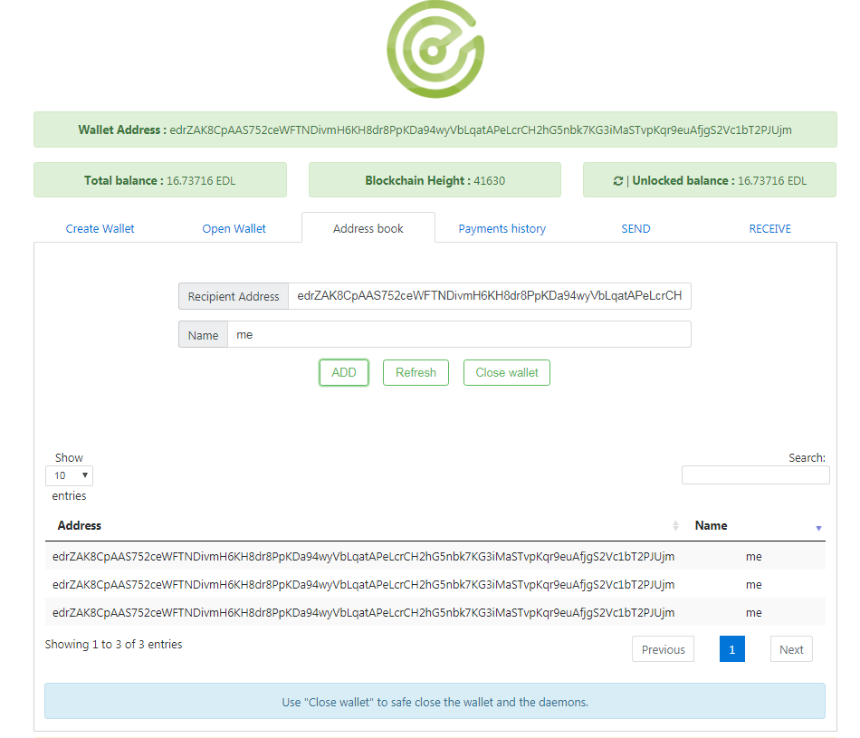
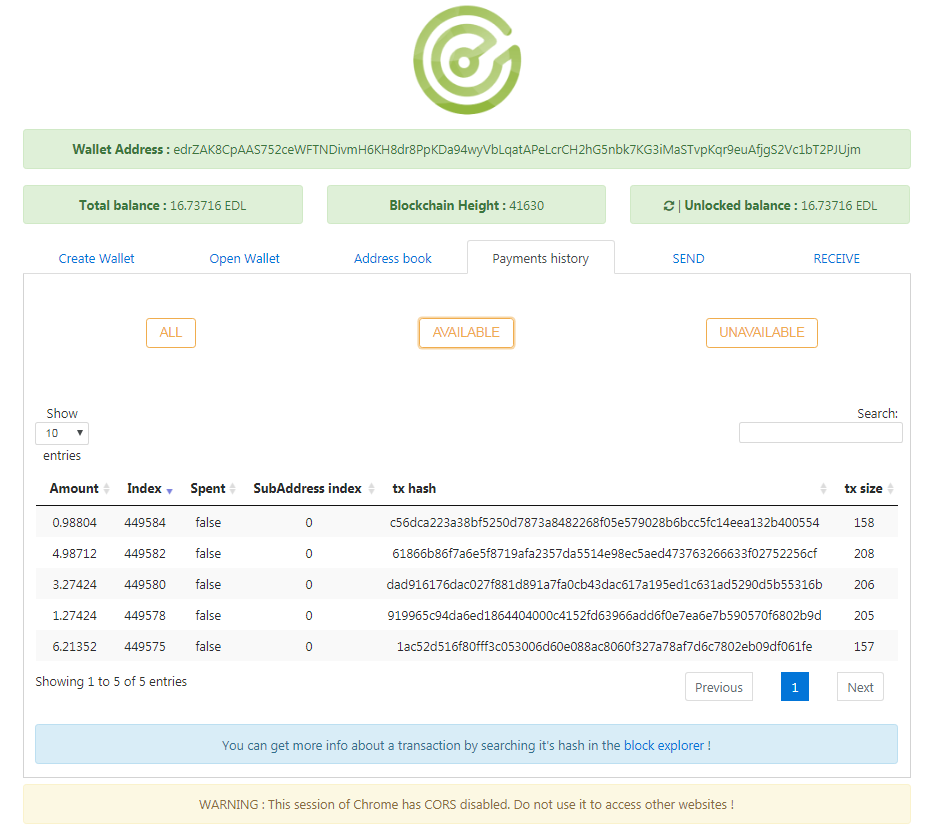
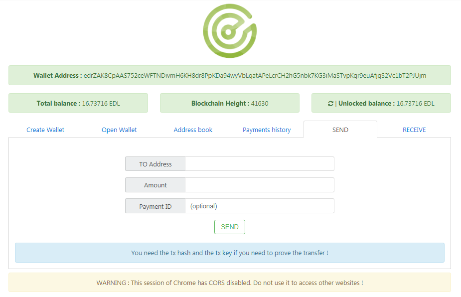
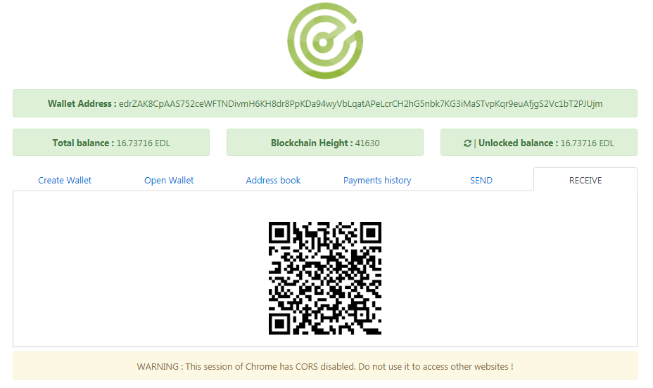

# edollar local gui rpc wallet

This guide will be updated based on user feedback, so please report the bugs.

How to use : 

Copy the files to your edollar folder - run start_wallet.bat, wait for the daemon to sync with the network.

Start_wallet.bat will start :  
edollar daemon 
edollar rpc daemon 
chrome with websecurity off - IT IS NOT SAFE TO USE THIS INSTANCE OF CHROME FOR BROWSING THE INTERNET  

If you already have a cli-wallet, copy the 3 wallet files to /wallets folder to use it.
The start_wallet script works on WINDOWS ONLY and needs Chrome to be installed. 

If Windows asks you about network permission for edollard.exe and edollar-wallet-rpc.exe, grant them.

This wallet is a wrapper for the existing commands in the rpc daemon. 

After you make a payment, wait at least 2-3 blocks for the balance to get updated.

Screenshots:

 
 
 
 
 
 
